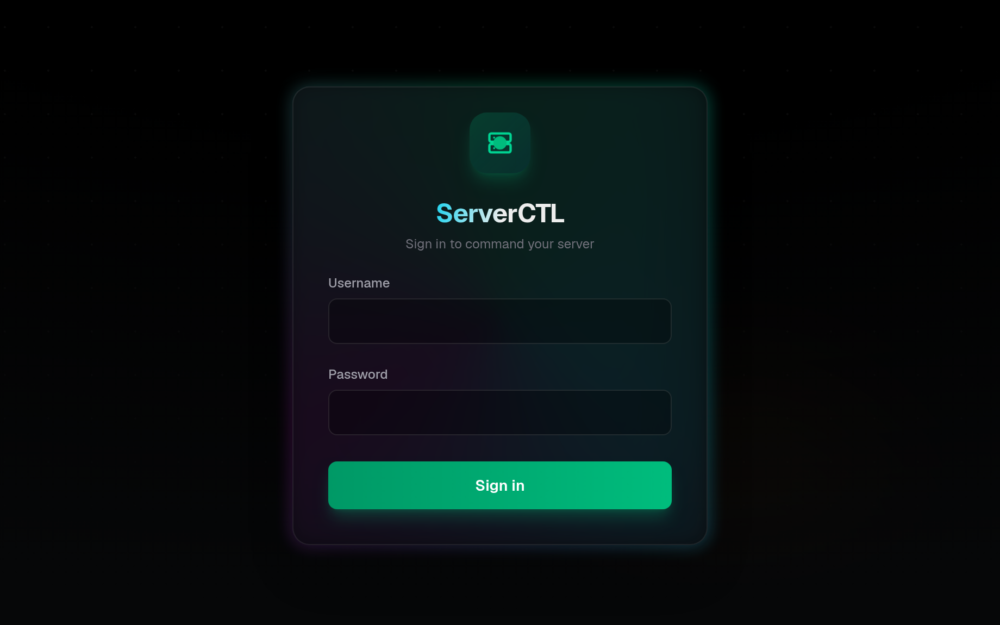

ServerCTL 

 - Making an application to control your home server from the dashboard.

 Use the install.py to install the dependencies.

 Also sun the setup.py to setup the login for the dashboard 

 To start the frontend and the backend run 

 - docker compose up -d --build

<<<<<<< Updated upstream
 You can see the dashboard in the localhost:3000
 
=======
<sub>Screenshots use synthetic data — IANA-reserved documentation ranges, not a
real host. See [`docs/screenshots/demo-server.py`](docs/screenshots/demo-server.py).</sub>

The dashboard and the API are one process on `127.0.0.1:3000`. There is nothing to
wire together and no CORS to configure.

> **This app is root-equivalent.** It mounts the Docker socket and runs with
> `pid: host`, so anyone who logs in can start a privileged container and own the
> machine. Treat the admin password like a root password, and never expose the port
> directly — put it behind a tunnel. Read [Security](docs/security.md) before you
> do.

---

## Install

Needs Linux with systemd, Docker, and the Compose plugin **v2.24+** (older ones
cannot parse this `docker-compose.yml`). Node and Python for the app itself live
inside the build.

```bash
git clone <repo-url> && cd ServerCTL
docker compose up -d --build
```

Open <http://localhost:3000>:



On first run the container generates an admin password and prints it once:

```bash
docker compose logs | grep -A6 "generated for you"
```

It is kept in a Docker volume, so it survives restarts and rebuilds. To choose
your own instead:

```bash
printf 'ADMIN_USERNAME=you\nADMIN_PASSWORD=your-secret\n' > backend/.env
docker compose up -d --force-recreate
```

It is hashed with scrypt at boot and only the hash is stored, but treat
`backend/.env` as a secret — Compose records its values in the container config.

If it does not come up, run `python3 preflight.py`; it checks the host side and
names what is wrong.

## Remote access

Point a [cloudflared](https://developers.cloudflare.com/cloudflare-one/connections/connect-networks/)
tunnel straight at the app — no nginx needed:

```yaml
# ~/.cloudflared/config.yml
ingress:
  - hostname: panel.example.com
    service: http://127.0.0.1:3000
  - service: http_status:404
```

**Then put Cloudflare Access in front of it.** One password is otherwise the only
thing between the internet and root on your box. This is the single
highest-value thing you can do — see [Security](docs/security.md).

## Documentation

| | |
|---|---|
| [Configuration](docs/configuration.md) | `backend/.env` keys, changing ports, the optional nginx proxy |
| [API reference](docs/api.md) | Endpoints, authentication, error shapes |
| [Security](docs/security.md) | What protects the login, what does not, and what to do before exposing it |
| [Troubleshooting](docs/troubleshooting.md) | Common failures, and known limitations |
| [Development](docs/development.md) | Local setup, the test suite, project layout |

## Everyday commands

```bash
docker compose logs -f                   # follow logs (auth events land here)
docker compose up -d --build             # after a code change
docker compose up -d --force-recreate    # after a backend/.env change
```

## License

[MIT](LICENSE) © 2026 Abishek Pechiappan

Provided as is, with no warranty — see the licence text. Given what this tool can
do to a machine, that disclaimer is worth reading rather than skipping.
>>>>>>> Stashed changes
